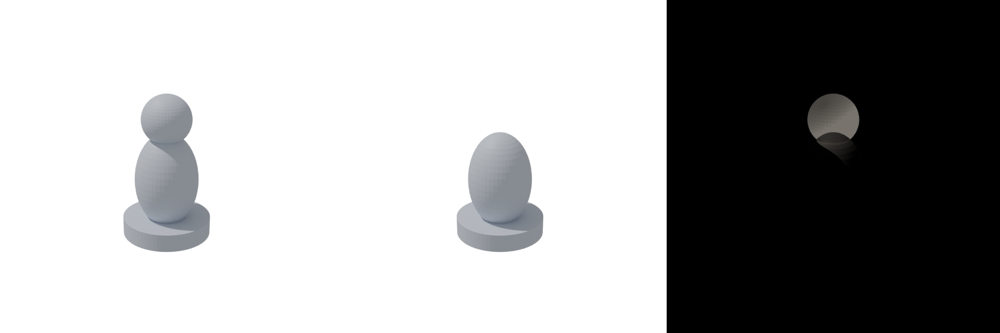

# Verified synthetic positive-master benchmark

Executed on native Apple-silicon Blender 4.5.13 LTS on 2026-09-16. The official macOS archive was verified against SHA-256 `663ce944257c61ff1d6aa09e15c8f57bbd8d59023adb2fa7edde33a9ed960b53` from the [official checksum file](https://download.blender.org/release/Blender4.5/blender-4.5.13.sha256).

The fixture is a positive pawn master: circular plinth, rounded body and round head. Its source specification defines 50 × 50 × 81 mm. The reference is rendered from that known specification, so the benchmark tests the workflow rather than independent reconstruction.

| Gate | Missing-head iteration | Repaired iteration |
| --- | ---: | ---: |
| Silhouette IoU | 0.806968 | 1.0 |
| Edge F1 | 0.934941 | 1.0 |
| Mean pixel similarity | 0.993094 | 1.0 |
| Declared dimensions | Failed | Passed |
| Final acceptance | Rejected | Passed after visual review |

The final mesh has one connected component, positive volume `0.00006626261046494386 m³`, zero non-manifold/inconsistent edges, zero loose vertices or degenerate faces, and zero detected nonadjacent intersections. Measured dimensions are `0.050000000745 × 0.050000000745 × 0.081000007689 m`. The STL smoke test independently verified its 81 mm height.

The actual reference, before/after comparison and back/side/top inspection images were inspected by the active agent. The neck undercut and polygonal surface were explicitly recorded; the benchmark does not certify silicone release, a particular printer or surface finish. Physical process review remains required for a real master.

The run reached `complete` only after visual review, verified `.blend`/GLB/STL packaging, and an evidence-backed lesson about checking major reference features. The lesson's aggregate improvement was `0.088332`, with no metric regression. Full run evidence is preserved in the local ignored `artifacts/master-benchmark-inspection-20260916/` directory; portable reference/comparison images are beside this report.

Reproduce with `python scripts/benchmark_master.py <new-directory> --blender <executable>`, perform the requested visual review, then record learning and close the run. The benchmark intentionally stops before review so an automated fixture cannot fabricate visual approval.
